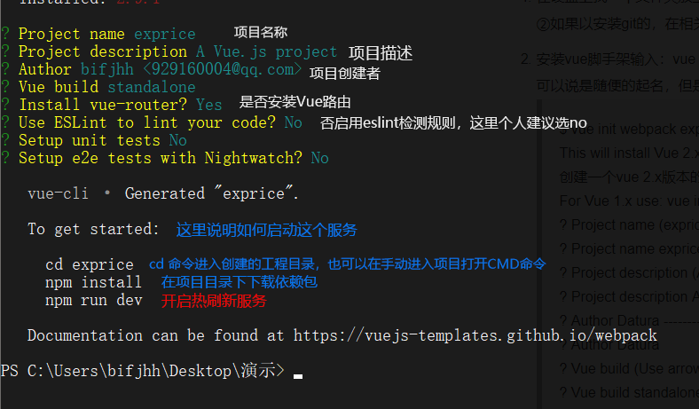
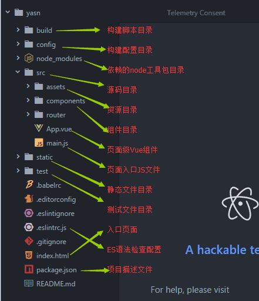
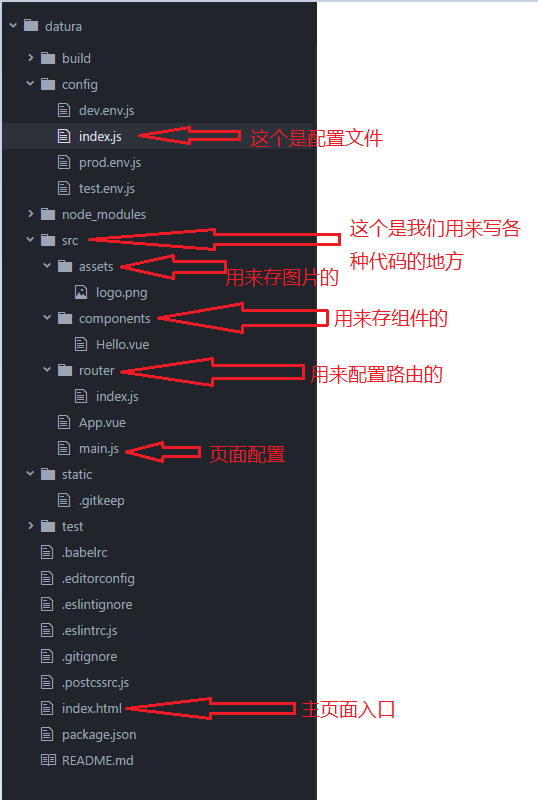

# 简介
- dev 配置 
- npm 是 JavaScript 的包管理器
- cnpm
- less 配置

- Wamp 集成环境配置
- 虚拟机配置
- Navicat Premium  数据库工具配置

- git 配置
- gulp 打包工具

- vue脚手架
- webpack 打包工具
- vue-cli  vue官方命令行工具

# NVM
- nvm全称Node Version Manager是 Nodejs 版本管理器，它让我们能方便的对 Nodejs 的版 本进行切换。 
- nvm 的官方版本只支持 Linux 和 Mac。 Windows 用户，可以用 nvm-windows

## 安装
- 它带有一个安装程序（和卸载程序），因为它应该很容易。请注意，在安装NVM for Windows之前，您需要卸载任何现有版本的node.js。还要删除所有可能保留的现有nodejs安装目录

1. 在C盘根目录下新建文件夹 dev
    + 在dev文件夹内 新建 nodejs、nvm 两个子文件夹
    + 一般开发相关的文件都放C盘，但是放别的盘也是可以的

2. 将nvm安装包解压到nvm文件夹内（最好直接解压，不要复制粘贴）    
- 解压出来的文件有
    + elevate.cmd
    + elevate.vbs
    + install.cmd
    + LICENSE
    + nvm.exe

3. 选择 install.cmd 文件； 右键，选择以管理员身份运行 
    + 这时会弹出一个setting.txt文本文档，如果没有，则在C盘根目录下查找，并将其移动到nvm文件夹目录下

4. 打开setting.txt文件，开始配置
    + root: C:\dev\nvm
    + path: C:\dev\nodejs
    + arch: 64 
    + proxy: none
-  * 重要强调 - setting.txt配置文件内，每一行的结束，不要有空格，不要有空格，不要有空格！！！

### 系统方面的配置
1. 找到我的电脑（win10是此电脑）——>右键点击属性——>选择高级系统设置——>选择系统变量（环境变量）

2. 添加变量
    + 变量名：NVM_HOME   -----  变量值 C:\dev\nvm
    + 变量名：NVM_SYMLINK   -----  变量值 C:\dev\nodejs
- 如果有，则可以选择修改或者删除
- 以上配置成功后，配置path变量属性
    + %NVM_HOME%   %NVM_SYMLINK%

3. 查看安装是否成功
- 打开CMD命令行工具
    + 输入`nvm version`  -- 查看有没有安装成功，若是出现版本信息，则安装成功。若报错，那就重新把步骤再捋一遍。
        + 检查环境变量是否配置成功：可以在控制台输入：set [环境变量名]，查看路径是否填写错误
    + 输入`nvm list` -- 查看有哪些 node 版本
    + 输入nvm use  --- 使用某一个版本  例如 ： `nvm use 8.6.0`

## 下载node.js
- 打开CMD命令行工具  
    + 输入`nvm install node@8.6.0 64` 下载node.js
        + 解释↑ nvm install node@+node.js的版本号 +安装的是32还是64  

    + 下载最新版的可以直接输`nvm install latest`    
    + 可以下载多个版本的node.js，通过`nvm use +版本号` 进行node.js的版本切换

### 查询
- 通过nvm use +版本号 选择使用的版本之后，
    + 在命令行输入 `node -v` 查询node.js版本
    + 在命令行输入 `npm -v` 查询npm版本    

#### npm
- 管理项目的依赖包
- 可以用来下载我们需要使用的东西
##### npm 基本使用
1. 初始化操作
    + `npm init` 会生成一个package.json文件 
    + `npm init -y ` 快速生成默认的package.json文件
2. 下载所需要的包
    + `npm install +包的名称` 

3. 约定使用的版本号
    + `npm install 包的名称 --save`
    + 下载之后会在package.json中添加当前下载的包的版本信息。
- 、为什么要保存至package.json？
    + 因为node插件包相对来说非常庞大，所以不加入版本管理，将配置信息写入package.json并将其加入版本管理，其他开发者对应下载即可
    + 命令提示符执行`npm install`，则会根据package.json下载所有需要的包，`npm install --production`只下载dependencies节点的包。    
### 安装cnpm
- 因为npm安装插件是从国外服务器下载，受网络影响大，可能出现异常，如果npm的服务器在中国就好了，所以我们乐于分享的淘宝团队干了这事。来自官网：“这是一个完整 npmjs.org 镜像，你可以用此代替官方版本(只读)，同步频率目前为 10分钟 一次以保证尽量与官方服务同步。”

- 在命令行输入 `npm install -g cnpm --registry=https://registry.npm.taobao.org`    

- 输入cnpm -v 查看是否安装成功

- 注意：安装完后最好查看其版本号cnpm -v或关闭命令提示符重新打开，安装完直接使用有可能会出现错误
        注：cnpm跟npm用法完全一致，只是在执行命令时将npm改为cnpm。

### 安装CSS预处理器 less
- Less 是一门预处理语言，支持变量、mixin、函数等额外功能。
- 在命令行输入 `npm install -g less` 安装
- 输入 `lessc -v` 查询版本

- 也可以可以选择使Koala是一个前端预处理器语言图形编译工具，支持Less、Sass、Compass、CoffeeScript，帮助web开发者更高效地使用它们进行开发。跨平台运行，完美兼容windows、linux、mac。   
    + [koala下载](http://koala-app.com/)   

#  Git安装
- Git是一款源代码管理工具(版本控制工具)
- 直接下载安装

## 常用命令
- 初始化Git仓库（仓储）
- 这个仓库会存放，git对我们项目代码进行备份的文件
- 在项目目录右键打开 git bash
    + 输入 `git init` 

- 设置当前使用Git的用户是谁,每一次备份都会将当前用户的用户名及邮箱信息存储起来，以便区分是谁进行的操作

- 配置用户名：
    + `git config --global user.name  "xxx"`

- 配置邮箱：  
    + `git config --global user.email "xxx@xx.com"`

- 暂存文件（还没有保存到git库）
    +  `git add ./文件路径`  将指定路径的文件暂存放到仓库门口
    +  `git add .`  将所有修改过的文件暂存

- 保存版本（文件）
    + `git commit -m "对本次添加东西的说明"`  将已经暂存的保存到库中
    + `git commit --all -m "对本次添加东西的说明"` 将所有修改过的文件直接放到房间内——不推荐

- 查看当前的状态
    + `git status`

- 查看日志
    + `git log` 查看历史提交的日志
    + `git log --oneline` 可以看到简洁版的日志

- 回退到指定的版本
    + git reset --hard Head~0
    + Head~0 是指回退到哪一个版本的状态
    + git reset --hard 版本号
    + 可以通过版本号精确的回退到某一次提交时的状态

- 查看每一次切换版本的记录:可以看到所有提交的版本号  
    + `git reflog`

### 分支操作    
- Git中的分支
    + 默认是有一个 主分支 master
    + 创建分支  `git branch dev` 创建了一个 名为 dev 的分支
    + 在刚创建时候 dev分支里的东西 和 master分支里的东西是一样的
- 切换分支    
    + `git checkout dev` 切换到指定的分支,这里的切换到名为dev的分支
- 查看当前库有哪些分支 
    + `git branch`    
- 合并分支
    + `git merge dev`  合并分支内容,把当前分支与指定的分支(dev),进行合并  
    + 当前分支指的是git branch命令输出的前面有*号的分支
### 提交代码到github(当作git服务器来用)
- 上传到远程的master分支上
    +  `git push [地址] master `
    +  示例: `git push https://github.com/huoqishi/test112.git master  master`
- 下载远程分支
    + 首先要先初始化一个本地git库    
    + `git pull [地址] master`
- 拷贝远程仓库
    + 不需要初始化本地gitku
    + `git clone [地址]`
    + 会得到远程仓储相同的数据,如果多次执行会覆盖本地内容。   
## Git中的忽略文件
- .gitignore,在这个文件中可以设置要被忽略的文件或者目录。
- 被忽略的文件不会被提交仓储里去.
- 在.gitignore中可以书写要被忽略的文件的路径，以/开头
- 一行写一个路径，这些路径所对应的文件都会被忽略,不会被提交到仓储中
- 语法
    + /.idea 会忽略.idea文件
    + /js      会忽略js目录里的所有文件
    + /js/*.js 会忽略js目录下所有js文件

## ssh方式上传代码
- 公钥 私钥,两者之间是有关联的。
- 生成公钥,和私钥
    + `ssh-keygen -t rsa -C "xxx@xxx.com"`
- 默认路径为
    + C:\Users\bifjhh\.ssh   下面的id_rsa.pub文件  
### 在远程库选择配置ssh密钥
- 将id_rsa.pub文件内的内容复制到密钥区域即可

### 在push和pull操作时
- 先pull , 再push
- 当我们在push时，加上-u参数，那么在下一次push时
  我们只需要写上git push就能上传我们的代码。(加上-u之后，git会把当前分支与远程的指定的分支进行关联。)

# gulp
- gulp是前端开发过程中对代码进行构建的工具，是自动化项目的构建利器；他不仅能对网站资源进行优化，而且在开发过程中很多重复的任务能够使用正确的工具自动完成；使用她，我们不仅可以很愉快的编写代码，而且大大提高我们的工作效率。

- gulp是基于Nodejs的自动任务运行器，能自动化地完成 javascript/coffee/sass/less/html/image/css 等文件的的测试、检查、合并、压缩、格式化、浏览器自动刷新、部署文件生成，并监听文件在改动后重复指定的这些步骤。在实现上，借鉴了Unix操作系统的管道（pipe）思想，前一级的输出，直接变成后一级的输入，使得在操作上非常简单。

## 本地安装gulp插件
-  全局安装 gulp：
    + `npm install --global gulp`
-  作为项目的开发依赖（devDependencies）安装：
    + ` npm install --save-dev gulp1`    
### 基本使用
- 在项目根目录下创建一个名为 gulpfile.js 的文件：
```javascript
    var gulp =  require('gulp');
    // 创建任务
    // 第一个参数: 任务名
    // 第二个参数: 回调函数,当我们执行任务时就会执行这个函数
    gulp.task('test', function(){
    console.log(123)
    })
```
- 运行 gulp：
    + 在命令行输入 `gulp 任务名`

#### 5个核心方法
- `gulp.task('任务名',function(){})` // 创建任务。
- `gulp.src('./*.css')` 指定想要处理的文件
- `gulp.dest()` // 指定最终处理后的文件的存放路径
- `gulp.watch()` // 自动的监视文件的变化，然后执行相应任务。
- `gulp.run('任务名')`，直接执行相应的任务。

#### 对js进行合并操作
- `npm install gulp-cssnano --save`
```javascript
    // 新建一个任务，对css进行处理
    gulp.task('style', function(){
    // 对项目中的2个css文件进行合并，压缩操作
    // 1.匹配到要处理的文件
    gulp.src(['./*.css'])
    // 2.合并文件
    .pipe(concat('index.css'))
    // 3.压缩操作
    .pipe(cssnano())
    // 4.输出到指定目录
    .pipe(gulp.dest('./dist'))
    })

```
#### 对html进行压缩
- `npm install gulp-htmlmin --save`
```javascript
    // 新建一个任务，对html进行压缩
    gulp.task('html', function(){
    // 1.匹配到要处理的文件
    gulp.src(['./index.html'])
    // 2.压缩操作
    .pipe(htmlmin({collapseWhitespace:true}))
    // 3.指定输出目录
    .pipe(gulp.dest('./dist'))
    })
```
#### gulp.watch
- 监视文件的变化，然后执行相应的任务
- gulp.run, 直接执行指定的任务
```javascript
    // gulp.watch 监视文件变化，执行相应任务
    gulp.task('mywatch', function(){
    // 执行指定的任务
    gulp.run('script')
    // 1.监视js文件的变化，然后执行script任务
    // 第一个参数：要监视的文件的规则
    // 第二个参数：是要执行的任务
    gulp.watch(['./app.js','sign.js'],['script'])
    })
```
# Wamp 集成环境配置
- windows 操作系统
- Apache 提供静态资源服务（html页面、js文件、css文件、图片。。。）
- MySQL 数据库
- php 编程语言，可以用来开发网站
## 安装
- 直接安装软件 完成安装后使用
### 配置根路径
> 默认的网站根路径是安装目录的www子目录（D:\wamp\www），如果不想使用默认目录，可以自己配置。配置方式如下：
1. 找到文件D:\wamp\bin\apache\Apache2.4.4\conf\httpd.conf 或者打开如下文件（实际是同一个文件）
  <br/>
  
2. 在文件中搜索DocumentRoot，找到239行位置
- 修改根路径为如下形式：(如果要配置虚拟主机，这里配置成根路径；如果不配置根路径，可以配置成D:\文件夹名；现在配置的是虚拟主机形式；两个位置应该保持一致)
  <br/>
  
### 配置虚拟主机
> 配置虚拟主机可以配置多个网站（域名和网站目录对应），配置步骤如下
1. 开启虚拟主机辅配置，在httpd.conf 文件 中找到如下位置,然后把前面的 # 号去掉
  <br/>
  
- 去掉`Include conf/extra/httpd-vhosts.conf`前面的 # 号，表示开启
- 一般是在499-500行
2. 配置虚拟主机
- 打开`\wamp\bin\apache\Apache2.4.4\conf\extra\httpd-vhosts.conf`文件
  <br/>
  
- 复制一份，进行修改
- 分别修改以下三项，其它项无需指定。
    + DocumentRoot "E:/www/example"
    + ServerName "example.com "
    + ServerAlias "www.example.com"
3. 修改DNS（hosts）文件 路径：`C:\Windows\System32\drivers\etc\hosts`文件
- 添加如下内容：
    + 127.0.0.1  example.com  
    + 127.0.0.1  www.example.com
- 注意，这里的域名需要和httpd-vhosts.conf文件 配置的域名一致  
4. 重启apache
- 访问http://www.example.com或者http://example.com 
- 能够显示则表示配置成功

### 配置多个虚拟主机的实例如下：
1. httpd-vhosts.conf文件配置
  <br/>
  
2. hosts文件配置
  <br/>
  
3. 重启apache
- 重启服务器之后按照配置的域名进行访问，查看配置是否成功

## Navicat Premium  数据库工具配置
1. 选择对应的版本进行安装
2. 安装完成之后使用激活工具进行激活
3. 开启Apache服务器后登陆数据库
4. 查看，修改，添加，删除，数据库内表单

# vue 脚手架
## 手动配置
1. 安装webpack，
- 打开命令行工具输入：`cnpm install webpack -g`，
- 安装完成之后输入 `webpack -v`如果出现相应的版本号，则说明安装成功。
2. 打包
- 在webpack入口文件中配置
- 在开发阶段下 在项目文件夹内创建 
    + src 文件夹   代码存放的位置
    + dist 文件夹  项目打包（上线）后代码存放的位置
    + 创建 `webpack.config.js` 文件 【固定命名】用于配置代码
        + 在使用时webpack打包时，在当前目录下 输入webpack，便会按照配置的属性，自动打包生成 
- 配置代码↓ 
 ```javascript 
// 导出一个对象
    module.exports={
        entry:'./src/main.js',//项目入口文件
        output:{//输入
            path:__dirname+'/dist',//打包后的文件放到哪一个目录，必须是个绝对目录
            filename:'build.js'//打包之后生成的文件名
        }
 ```
### Loaders
- 通过使用不同的loader，webpack有能力调用外部的脚本或工具，实现对不同格式的文件的处理，比如说分析转换scss为css，或者把下一代的JS文件（ES6，ES7)转换为现代浏览器兼容的JS文件，对React的开发而言，合适的Loaders可以把React的中用到的JSX文件转换为JS文件。

#### 打包css文件
- 初始化npm
- 安装打包css文件的依赖包
  `cnpm install style-loader css-loader --save-dev`
 - 在webpack.config.js 中添加配置 module 选项
 ```javascript
    module:{//打包css需要添加配置 moudle 选项
        loaders:[
            {  
                test: /\.css$/, //利用正则匹配所有的.css文件
                loader: 'style-loader!css-loader'
                //顺序不能错 
            }
        ]
    }
}
 ```
- 注意
    + 打包CSS文件，你首先要引入一个css文件
- 在项目目录中新建 static 静态资源目录
    + 在static 下建立css文件 
    + 目录随意，但是路径要写对
- 在入口文件中导入 css文件 `require('../static/css/site.css')`   
- 然后 输入 webpack 打包

#### 打包scss文件
- 下载依赖包`cnpm install node-sass sass-loader  --save-dev`
- 在webpack.config.js 中添加配置scss依赖的loader
- 代码↓
```javascript
    {//增加scss配置
        test: /\.scss$/, //匹配所有的.scss文件
        loader: 'style-loader!css-loader!sass-loader'
    }   
```
- 建立scss文件 并在入口文件中导入
- 打包

#### 打包Less文件
- 下载依赖包 `cnpm install less less-loader --save-dev`
- 在webpack.config.js 中添加配置less依赖的loader
- 代码↓
```javascript
 {//增加less配置
    test: /\.less/, //打包 .less文件
    loader: 'style-loader!css-loader!less-loader'
}
```
- 建立less文件 并在入口文件中导入
- 打包

#### 打包url资源
- 下载依赖包`cnpm install url-loader file-loader --save-dev`
- 在webpack.config.js 中配置这两个loader
- 代码↓
```javascript
{
    test:/\.(png|jpg|gif|ttf|svg)$/,//打包url请求的资源文件
    loader:'url-loader?limit=20000' //limit表示图片的大小为20K是临界值，小于20K的图片均被打包到build.js中去，请求图片就会很快
}          
```
- 在css文件导入一个图片设置 
- 打包

### webpack-dev-serve实现热刷新热加载
- 需要安装的node包有：
    + webpack-dev-server ： 
        + webpack开发服务器
    + html-webpack-plugin ：
        + 结合webpack在内存中自动生成index.html的入口文件
- 在项目根目录下打开cmd命令面板，输入：
    + `cnpm install webpack@1.14.0 webpack-dev-server@1.16.0 html-webpack-plugin  --save-dev` 回车即可完成下载安装 
        + webpack 和 webpack-dev-server 版本 根据自己项目的开发需要，进行选择        
- 在package.json文件中配置webpack-dev-server命令
```javascript
"scripts": {
        "dev":"webpack-dev-server --inline --hot --open --port 4009"
    }
/* 参数说明：
    inline :自动刷新
    hot :热加载
    port 指定监听端口为 5200
    open : 自动在默认浏览器中打开
    host： 可以指定服务器的ip，不指定默认为127.0.0.1(localhost) */
```
- 配置html-webpack-plugin组件
    + webpack-dev-server要实现浏览器自动刷新，必须要利用html-webpack-plugin在内存中生成index.html页面才能实现
    + html-webpack-plugin 配置步骤：
- 在webpack.config.js中加入如下代码：
 ```javascript  
    // 导入html-webpack-plugin 包,获取到插件对象
    var htmlwp = require('html-webpack-plugin');
    plugins:[
        new htmlwp({
        title: '首页',  //生成的页面标题
        filename: 'index.html', //webpack-dev-server在内存中生成的文件名称，自动将build注入到这个页面底部，才能实现自动刷新功能
        template: 'index1.html' //根据index1.html这个模板来生成(这个模板文件自己创建)
        })
    ]
 ```
- 开启热刷新效果
    + 在cmd中执行`npm run dev` 命令开启 webpack-dev-server服务器来运行vue项目
    + 这时候可以随便修改一个css样式，就会自动刷新看到效果

### webpack3.0实现es6转es5
- 重新安装新的webpack和webpack-dev-server
- 在入口文件main.js中将es5写法更改weies6写法
- 代码↓
```javascript
// 导入文件 
// require('../static/css/site.css');//es5语法
// require('../static/css/sitel.scss');//es5语法
// require('../static/css/site2.less');//es5语法
// 使用es6语法导入 
import '../static/css/site.css'; //不返回函数对象的直接在import 后面写 路径
import addObj from './calc.js'; //返回的对象的，需要设置接受的名称，另外不能写在某一函数的内部，必须写在顶级（全局）
    bt.onclick = function () {
        //获取calc.js中的add方法并且调用计算结果
        var v1value = parseFloat(v1.value);
        var v2value = parseFloat(v2.value);
        // 调用add方法
        // var add = require('./calc.js'); //es5语法
        // res.value = add(v1value, v2value);//es5语法
        res.value = addObj.add(v1value, v2value);
    }
```
- 更改js文件中的导出写法
```javascript
// 导出add方法
// module.exports = add;//es5写法
    export default {
        // add：add
        add //在es6当中 属性名称和属性值变量同名的时候可以只写一个，相当于es5中的 add：add
    }
```
- 然后运行webpack进行打包

### 利用webpack解析和打包.vue组件页面
-  Vue项目中的每个页面其实都是一个.vue的文件，这种文件，Vue称之为组件页面，必须借助于 webpack的vue-loader才能使用
-  安装相关包：
    + `cnpm install vue-loader vue-template-compiler --save-dev`
    + `cnpm intall vue --save`

-  在webpack.config.js中的loaders中增加
```javascript
    {
        test:/\.vue$/,   //匹配所有的.vue文件
        loader:'vue-loader' //依赖的loader包名
    }    
```
- vue组件页面的写法结构
- 创建一个根组件   整个项目的根组件
```html   
<template>
    <!-- 页面结构 -->
    <div class="tmpl"></div>
    <!-- 由于是vue2.0 所以这个里面一定要放一个根元素，也可以放vue的指令 v- -->
</template>

<script> 
// 本质上是一个vue组件
    export default {
        data(){  //等价于 es5的 data:function(){
            return {
            name: "人生不过一场场的遇见."
            };
        }
    };
// 就是导出一个 Vue的实例  
</script>

<!-- <style></style> -->  <!-- 这种样式默认是全局的 -->
<style scoped></style> <!-- 添加scoped 代表样式仅在当前vue组件内有效 -->
```

- 将.vue中的内容解析编译并且展示在浏览器中
- 在main.js（入口文件）中编写解析.vue的代码
```javascript
    import Vue from 'vue'; //类似于script导入vue核心包
    import App from "./APP.vue"; //导入App.vue的vue对象
    // 利用Vue对象进行解析渲染
    new Vue({
        el: '#app',
        // render:function(create){create(App);}  //es5语法
        render: c => c(App) //es6的函数写法 => 箭头函数
    });
```
## 使用官方命令行工具配置脚手架模板
### vue-cli 
- Vue.js 提供一个官方命令行工具，可用于快速搭建大型单页应用。该工具提供开箱即用的构建工具配置，带来现代化的前端开发流程。只需几分钟即可创建并启动一个带热重载、保存时静态检查以及可用于生产环境的构建配置的项目：
### 安装基本环境
- 基于node的基础之上，必须先安装node
1. 首先安装webpack
- 打开命令行工具输入：
    + `cnpm install webpack -g`，
- 安装完成之后输入 
    + `webpack -v`
- 如果出现相应的版本号，则说明安装成功。

2. 安装vue-cli脚手架构建工具
- 打开命令行工具输入：
    + `cnpm install vue-cli -g`，
- 安装完成之后输入 
    + `vue -V`（注意这里是大写的“V”），
- 如果出现相应的版本号，则说明安装成功。

### 使用vue-cli 来构建项目
1. 建立项目文件位置
2. 安装vue脚手架官方模板
- 在命令行输入 vue init webpack exprice 
    + 注意这里的“exprice” 是项目的名称可以说是随便的起名，但是需要主要的是“不能用中文”
3. 配置选项
  <br/>
  
4. 创建后的项目目录说明
  <br/>
  
  <br/>
  

### 说明：
- 在*.vue文件，template标签里写html代码，且template直接子级只能有一个标签。style标签里写样式，script里面写js代码
> 页面：index.html
- 就是一个简单的html页面，这里id='app'，是为后面的设置vue作用域有关的。
```html 
<!DOCTYPE html>
<html>
  <head>
    <meta charset="utf-8">
    <title>datura</title>
  </head>
  <body>
    <div id="app"></div>  
    <!-- built files will be auto injected -->
  </body>
</html>

```
> 文件：Hello.vue

```html 
<template>
  <div class="hello">
    <h1>{{ msg }}</h1>  <!-- 这里是展示数据中的  -->
    <h2>Essential Links</h2>
    <ul>
      <li><a href="https://vuejs.org" target="_blank">Core Docs</a></li>
      <li><a href="https://forum.vuejs.org" target="_blank">Forum</a></li>
      <li><a href="https://gitter.im/vuejs/vue" target="_blank">Gitter Chat</a></li>
      <li><a href="https://twitter.com/vuejs" target="_blank">Twitter</a></li>
      <br>
      <li><a href="http://vuejs-templates.github.io/webpack/" target="_blank">Docs for This Template</a></li>
    </ul>
    <h2>Ecosystem</h2>
    <ul>
      <li><a href="http://router.vuejs.org/" target="_blank">vue-router</a></li>
      <li><a href="http://vuex.vuejs.org/" target="_blank">vuex</a></li>
      <li><a href="http://vue-loader.vuejs.org/" target="_blank">vue-loader</a></li>
      <li><a href="https://github.com/vuejs/awesome-vue" target="_blank">awesome-vue</a></li>
    </ul>
  </div>
</template>
<script>
export default {
  name: 'hello',   /* 这个name暂时不知道用啥用，根据官方文档说的是方便排错的 */
  data () {
    return {
      msg: 'Welcome to Your Vue.js App'   /* 这里是数据，一定记住数据一定要放data中然后用return返回 */
    }
  }
}
</script>
<!-- Add "scoped" attribute to limit CSS to this component only -->
<style scoped>   /*  scoped的意思是这里的样式只对当前页面有效不会影响其他页面，还有可以设置lang="scss"就是支持css预编译，也就是支持sass或者less  */
h1, h2 {
  font-weight: normal;
}
ul {
  list-style-type: none;
  padding: 0;
}
li {
  display: inline-block;
  margin: 0 10px;
}
a {
  color: #42b983;
}
</style>

```
> 文件：App.vue
```html
<template>
  <div id="app">
    <router-view></router-view>   <!--  这里是用来展示路由页面内容的，如果想用跳转就用<router-link to='xxx'></router-link> -->
  </div>
</template>
<script>
export default {
  name: 'app'
}
</script>
<style>
#app {
  font-family: 'Avenir', Helvetica, Arial, sans-serif;
  -webkit-font-smoothing: antialiased;
  -moz-osx-font-smoothing: grayscale;
  text-align: center;
  color: #2c3e50;
  margin-top: 60px;
}
</style>

```
> 文件：main.js
- 这个js文件是主页面配置的主入口。主要是利用es6的模块化引入模块。

```javascript
import Vue from 'vue'   /* 这里是引入vue文件 */
import App from './App'  /* 这里是引入同目录下的App.vue模块 */
import router from './router'  /* 这里是引入vue的路由 */

/* eslint-disable no-new */
new Vue({
  el: '#app',  /* 定义作用范围就是index.html里的id为app的范围内 */
  router,    /* 引入路由 */
  template: '<App/>',   /* 给Vue实例初始一个App组件作为template 相当于默认组件 */
  components: { App }  /* 注册引入的组件App.vue */
})
```
> 文件：index.js
- 这个是配置路由的页面
```javascript
import Vue from 'vue'   /* 引用vue文件 */
import Router from 'vue-router'  /* 引用vue路由模块，并赋值给变量Router */
import Hello from '@/components/Hello'  /* 英文Hello.vue模版，并赋值给变量Hello,这里是“@”相当于“../” */
Vue.use(Router)   /* 使用路由 */
export default new Router({
  routes: [     /* 进行路由配置，规定“/”引入到Hello组件 */
    {
      path: '/',
      name: 'Hello',  /* 这里的name同上，暂时没发现有什么意思 */
      component: Hello   /* 注册Hello组件 */
    }
  ]
})

```
#### 附加
- 说明：
- 如果需要增加组件那就在components文件下定义xx.vue文件并编写代码即可
- 如果需要配置路由就要进行在index.js进行路由“路径”配置，还需要点击跳转就要用到<router-link></router-link>标签了。


