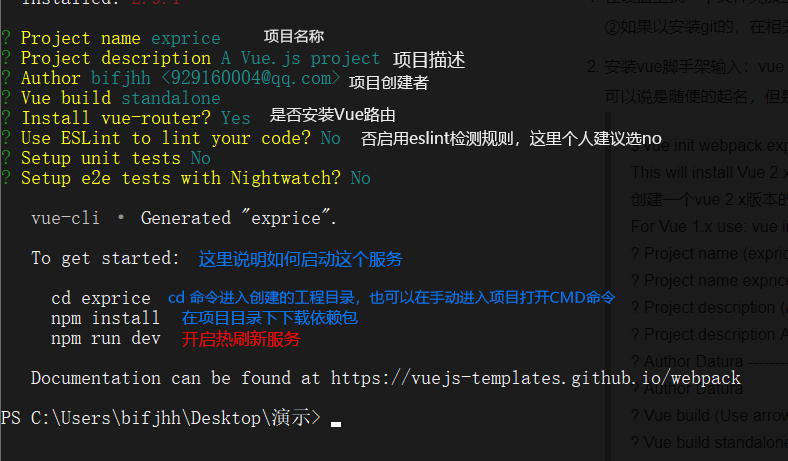
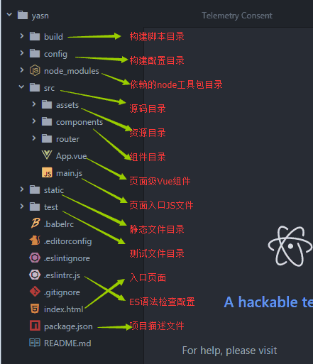
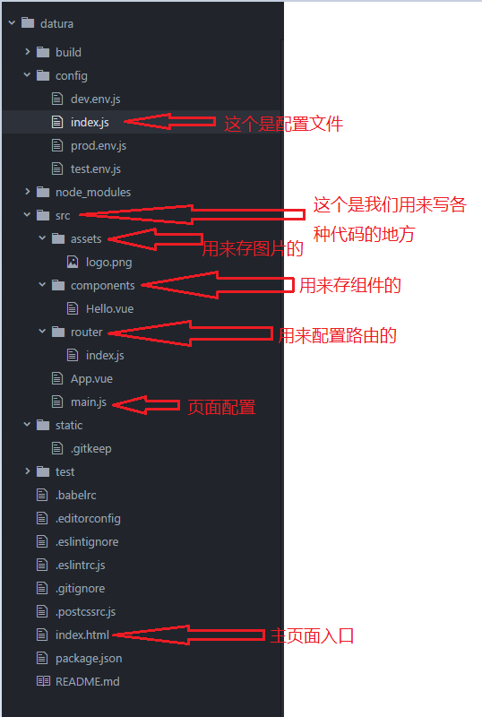

# vue 脚手架
- 使用官方命令行工具配置脚手架模板
### vue-cli 
- Vue.js 提供一个官方命令行工具，可用于快速搭建大型单页应用。该工具提供开箱即用的构建工具配置，带来现代化的前端开发流程。只需几分钟即可创建并启动一个带热重载、保存时静态检查以及可用于生产环境的构建配置的项目：
### 安装基本环境
- 基于node的基础之上，必须先安装node
1. 首先安装webpack
- 打开命令行工具输入：
    + `cnpm install webpack -g`，
- 安装完成之后输入 
    + `webpack -v`
- 如果出现相应的版本号，则说明安装成功。

2. 安装vue-cli脚手架构建工具
- 打开命令行工具输入：
    + `cnpm install vue-cli -g`，
- 安装完成之后输入 
    + `vue -V`（注意这里是大写的“V”），
- 如果出现相应的版本号，则说明安装成功。

### 使用vue-cli 来构建项目
1. 建立项目文件位置
2. 安装vue脚手架官方模板
- 在命令行输入 vue init webpack exprice 
    + 注意这里的“exprice” 是项目的名称可以说是随便的起名，但是需要主要的是“不能用中文”
3. 配置选项
<br/>

4. 创建后的项目目录说明
<br/>

<br/>


### 说明：
- 在*.vue文件，template标签里写html代码，且template直接子级只能有一个标签。style标签里写样式，script里面写js代码
> 页面：index.html
- 就是一个简单的html页面，这里id='app'，是为后面的设置vue作用域有关的。
```html 
<!DOCTYPE html>
<html>
  <head>
    <meta charset="utf-8">
    <title>datura</title>
  </head>
  <body>
    <div id="app"></div>  
    <!-- built files will be auto injected -->
  </body>
</html>

```
> 文件：Hello.vue

```html 
<template>
  <div class="hello">
    <h1>{{ msg }}</h1>  <!-- 这里是展示数据中的  -->
    <h2>Essential Links</h2>
    <ul>
      <li><a href="https://vuejs.org" target="_blank">Core Docs</a></li>
      <li><a href="https://forum.vuejs.org" target="_blank">Forum</a></li>
      <li><a href="https://gitter.im/vuejs/vue" target="_blank">Gitter Chat</a></li>
      <li><a href="https://twitter.com/vuejs" target="_blank">Twitter</a></li>
      <br>
      <li><a href="http://vuejs-templates.github.io/webpack/" target="_blank">Docs for This Template</a></li>
    </ul>
    <h2>Ecosystem</h2>
    <ul>
      <li><a href="http://router.vuejs.org/" target="_blank">vue-router</a></li>
      <li><a href="http://vuex.vuejs.org/" target="_blank">vuex</a></li>
      <li><a href="http://vue-loader.vuejs.org/" target="_blank">vue-loader</a></li>
      <li><a href="https://github.com/vuejs/awesome-vue" target="_blank">awesome-vue</a></li>
    </ul>
  </div>
</template>
<script>
export default {
  name: 'hello',   /* 这个name暂时不知道用啥用，根据官方文档说的是方便排错的 */
  data () {
    return {
      msg: 'Welcome to Your Vue.js App'   /* 这里是数据，一定记住数据一定要放data中然后用return返回 */
    }
  }
}
</script>
<!-- Add "scoped" attribute to limit CSS to this component only -->
<style scoped>   /*  scoped的意思是这里的样式只对当前页面有效不会影响其他页面，还有可以设置lang="scss"就是支持css预编译，也就是支持sass或者less  */
h1, h2 {
  font-weight: normal;
}
ul {
  list-style-type: none;
  padding: 0;
}
li {
  display: inline-block;
  margin: 0 10px;
}
a {
  color: #42b983;
}
</style>

```
> 文件：App.vue
```html
<template>
  <div id="app">
    <router-view></router-view>   <!--  这里是用来展示路由页面内容的，如果想用跳转就用<router-link to='xxx'></router-link> -->
  </div>
</template>
<script>
export default {
  name: 'app'
}
</script>
<style>
#app {
  font-family: 'Avenir', Helvetica, Arial, sans-serif;
  -webkit-font-smoothing: antialiased;
  -moz-osx-font-smoothing: grayscale;
  text-align: center;
  color: #2c3e50;
  margin-top: 60px;
}
</style>

```
> 文件：main.js
- 这个js文件是主页面配置的主入口。主要是利用es6的模块化引入模块。

```javascript
import Vue from 'vue'   /* 这里是引入vue文件 */
import App from './App'  /* 这里是引入同目录下的App.vue模块 */
import router from './router'  /* 这里是引入vue的路由 */

/* eslint-disable no-new */
new Vue({
  el: '#app',  /* 定义作用范围就是index.html里的id为app的范围内 */
  router,    /* 引入路由 */
  template: '<App/>',   /* 给Vue实例初始一个App组件作为template 相当于默认组件 */
  components: { App }  /* 注册引入的组件App.vue */
})
```
> 文件：index.js
- 这个是配置路由的页面
```javascript
import Vue from 'vue'   /* 引用vue文件 */
import Router from 'vue-router'  /* 引用vue路由模块，并赋值给变量Router */
import Hello from '@/components/Hello'  /* 英文Hello.vue模版，并赋值给变量Hello,这里是“@”相当于“../” */
Vue.use(Router)   /* 使用路由 */
export default new Router({
  routes: [     /* 进行路由配置，规定“/”引入到Hello组件 */
    {
      path: '/',
      name: 'Hello',  /* 这里的name同上，暂时没发现有什么意思 */
      component: Hello   /* 注册Hello组件 */
    }
  ]
})

```
#### 附加
- 说明：
- 如果需要增加组件那就在components文件下定义xx.vue文件并编写代码即可
- 如果需要配置路由就要进行在index.js进行路由“路径”配置，还需要点击跳转就要用到<router-link></router-link>标签了。

