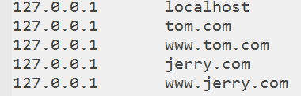

# Wamp 集成环境配置
- windows 操作系统
- Apache 提供静态资源服务（html页面、js文件、css文件、图片。。。）
- MySQL 数据库
- php 编程语言，可以用来开发网站
## 安装
- 直接安装软件 完成安装后使用
### 配置根路径
> 默认的网站根路径是安装目录的www子目录（D:\wamp\www），如果不想使用默认目录，可以自己配置。配置方式如下：

- 找到文件D:\wamp\bin\apache\Apache2.4.4\conf\httpd.conf 或者打开如下文件（实际是同一个文件）
   
  
   
- 在文件中搜索DocumentRoot，找到239行位置
- 修改根路径为如下形式：(如果要配置虚拟主机，这里配置成根路径；如果不配置根路径，可以配置成D:\文件夹名；现在配置的是虚拟主机形式；两个位置应该保持一致)
   
  
   
### 配置虚拟主机
> 配置虚拟主机可以配置多个网站（域名和网站目录对应），配置步骤如下
- 开启虚拟主机辅配置，在httpd.conf 文件 中找到如下位置,然后把前面的 # 号去掉
   
  
   
- 去掉`Include conf/extra/httpd-vhosts.conf`前面的 # 号，表示开启
- 一般是在499-500行
- 配置虚拟主机
- 打开`\wamp\bin\apache\Apache2.4.4\conf\extra\httpd-vhosts.conf`文件
   
  
   
- 复制一份，进行修改
- 分别修改以下三项，其它项无需指定。
    + DocumentRoot "E:/www/example"
    + ServerName "example.com "
    + ServerAlias "www.example.com"
- 修改DNS（hosts）文件 路径：`C:\Windows\System32\drivers\etc\hosts`文件
- 添加如下内容：
    + 127.0.0.1  example.com  
    + 127.0.0.1  www.example.com
- 注意，这里的域名需要和httpd-vhosts.conf文件 配置的域名一致  
- 重启apache
- 访问http://www.example.com或者http://example.com 
- 能够显示则表示配置成功

### 配置多个虚拟主机的实例如下：
- httpd-vhosts.conf文件配置
   
  
   
- hosts文件配置
   
  
   
- 重启apache
- 重启服务器之后按照配置的域名进行访问，查看配置是否成功

## Navicat Premium  数据库工具配置
- 选择对应的版本进行安装
- 安装完成之后使用激活工具进行激活
- 开启Apache服务器后登陆数据库
- 查看，修改，添加，删除，数据库内表单 
